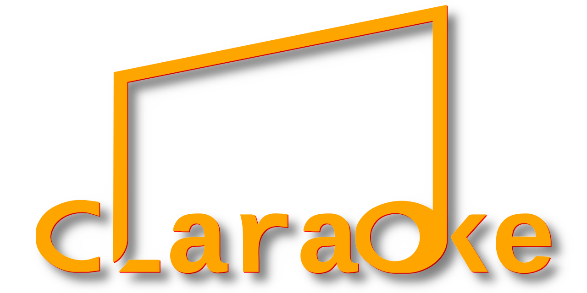

<p align="center">
    
</p>

# CLARAOKE (WIP)

CLARAOKE is a system for writing karaoke typesetting according to ASS
format. (Advanced Substation Alpha)

Author: _Panji Kusuma (epanji@gmail.com)_

---------------------------------------------------------------------------------------------------------

## Examples

| _Example file [mysub.lisp](Examples/mysub.lisp)_ | _Example file [mysub2.lisp](Examples/mysub2.lisp)_ |
|--------------------------------------------------|----------------------------------------------------|
|                |                 |

---------------------------------------------------------------------------------------------------------

## Quick Introduction

Writing subtitle script especially KARAOKE need too much focus on
counting characters and timing. With semi-automatic when adding
karaoke in the text, it will lift a little burden for people who
writing it. It is possible to create events by looping with random
values or writing logic like in programming. In other words, writing
subtitle script with capability of programming language.

### Duration

When working with timing, converting time format to real number or
vise versa would be hard and time consuming. CLARAOKE have the
solution by accepting either number or time format to create a
DURATION object. This object could be modified with other duration
object, number or time format. And for final step to write it into
subtitle script, DURATIONSTRING provided to convert them to string
which accepted by subtitle script.

An example of creating a DURATION object and the process increasing
it's value:

```common-lisp
(defparameter *obj* (duration "3:25:45"))

(increase-duration *obj* 67)
```

The results of the example below should all be ``T``:

```common-lisp
(= (durationinteger *obj*) 1234567)

(string= (durationstring *obj*) (durationstring 1234567))

(zerop (duration-difference "3:25:45.67" 1234567))
```

### Color

Having black and white normally enough colors for subtitle. But, it is
better to have more for creativity. CLARAOKE provided COLOR to create
color object using name or html-color. RGB could be used to create
color object from numbers represents red, green and blue. RANDOM-COLOR
could be used to get inspiration by creating random color
object. Talking about colors, don't forget about ALPHA which can be
used to set the COLOR object. Similar with duration, to write it into
subtitle script, there is function called COLORSTRING. ALPHASTRING
also provided to write only alpha as string which accepted by subtitle
script.

The examples below should all return the value ``T``:

```common-lisp
(string= (colorstring "Blue Violet") (colorstring "#8A2BE2"))

(string= (colorstring "&HE22B8A&") (colorstring (rgb 138 43 226)))

(string= (alphastring (color "#8A2BE24D")) (alphastring (color "&H4DE22B8A")))

(string= (alphastring "#4D") (alphastring "&H4D&"))

(string= (alphastring "4D") (alphastring 77))

(string= (alphastring (rgb 138 43 226 77)) (alphastring (random-color 3/10)))
```

### Text

Do not mistaken TEXT object with plain text. The TEXT could have one
plain text with several OVERRIDES which contain several
MODIFIERS. TEXT object could be customize by supplying keyargs during
creation. TEXT object is not written directly into the subtitle
script, but is inserted as part of the DIALOGUE object. TEXT keyargs
also works when creating DIALOGUE object.

This is an example of ``TEXT`` creation using plain text:

```common-lisp
(text "Hello world!")

(text "Hello world!" :generate-overrides-p t)

(text "Hello world!" :generate-overrides-p t :spell-duration 50)

(text "Hello world!" :generate-overrides-p t :spell-duration 50 :change-karaoke-type :fill)

(text "Hello world!" :generate-overrides-p t :spell-duration 50 :change-karaoke-type :outline)
```

This is an example of ``TEXT`` creation using the overridden text:

```common-lisp
(text "{\\K50\\What}Hel{\\K50}lo {\\K50}world!")

(text "{\\K50\\What}Hel{\\K50}lo {\\K50}world!" :remove-unknown-modifier-p t)

(text "{\\K50\\What}Hel{\\K50}lo {\\K50}world!" :remove-unknown-modifier-p t :keep-original-modifier-p t)
```

### Subtitle

SUBTITLE is the main object to hold other objects before they are
ready to be printed. When creating a SUBTITLE object, adjustment of
the default STYLE and the first DIALOGUE can be achieved by supplying
keyargs. The KEY arguments for STYLE and EVENT that have the same KEY
must use class name before the KEY as PREFIX.

This is an example of ``SUBTITLE`` creation:

```common-lisp
(subtitle "Title")

(subtitle "" :title "Empty String")

(subtitle nil :title "Ignore All Arguments")

(subtitle "Prefix" :style-margin-v 15 :event-margin-v 30)
```

This is an example of ``DIALOGUE`` creation:

```common-lisp
(dialogue "Hello world!" :end "1:2.34")

(dialogue "Hello world!!" :start "1:2.34" :duration 6234)

(dialogue "Hello world!!!" :start (* 2 6234) :end (* 3 (durationinteger "1:2.34")))
```

# Tests

``` common-lisp
(with-open-file (stream #p"tests-result.txt"
                        :direction :output
                        :if-exists :supersede
                        :if-does-not-exist :create)
  (let ((*standard-output* stream))
    (format t "<pre>~%")
    (asdf:test-system "claraoke")
    (format t "~2&</pre>")))
```

_Open tests result [HERE](tests-result.txt)._

# License


