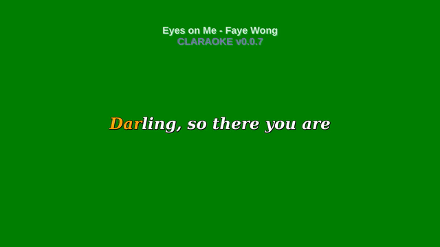

# CLARAOKE (WIP)

CLARAOKE is a system for writing karaoke typesetting according to ASS format. (Advanced Substation Alpha)

Author: _Panji Kusuma (epanji@gmail.com)_

## Examples

_Example file [mysub.lisp](Examples/mysub.lisp)_



## Progress

```common-lisp

CL-USER> (ql:quickload "claraoke-user")
("claraoke-user")

CL-USER> (in-package :claraoke-user)
#<PACKAGE "CLARAOKE-USER">

CLARAOKE-USER> (load (merge-pathnames "Examples/mysub.lisp" (asdf:system-source-directory :claraoke)))
T

CLARAOKE-USER> (defparameter *parsed* (parse-script #p"/tmp/mysub.ass"))
*PARSED*

CLARAOKE-USER> (print-script *parsed*)
[Script Info]
; Script generated by CLARAOKE v0.0.7 ( https://github.com/epanji/claraoke )
Title: Eyes on Me
ScriptType: v4.00+
Collisions: Normal
PlayResX: 1280
PlayResY: 720
PlayDepth: 0
Timer: 100.0000
WrapStyle: 0

[V4+ Styles]
Format: Name, Fontname, Fontsize, PrimaryColour, SecondaryColour, OutlineColour, BackColour, Bold, Italic, Underline, StrikeOut, ScaleX, ScaleY, Spacing, Angle, BorderStyle, Outline, Shadow, Alignment, MarginL, MarginR, MarginV, Encoding
Style: Default,DejaVu Serif,54,&H0000A5FF,&H00FFFFFF,&H00000000,&H00000000,-1,-1,0,0,100,100,0,0,1,1,1,5,25,25,72,1
Style: Title,DejaVu San,32,&H30FFFFFF,&H00FFFFFF,&H00000000,&HA0D4FF7F,-1,0,0,0,100,100,0,0,1,0,2,8,25,25,72,1
Style: Notes,DejaVu San,32,&H30C36888,&H00FFFFFF,&H00000000,&HA0D4FF7F,-1,0,0,0,100,100,0,0,1,0,2,8,25,25,72,1

[Events]
Format: Layer, Start, End, Style, Name, MarginL, MarginR, MarginV, Effect, Text
Dialogue: 0,0:00:27.60,0:00:32.40,Default,,0,0,0,,{\k30}Whe{\k90}ne{\k30}ver {\k90}sang {\k30}my {\k30}songs
Dialogue: 0,0:00:33.00,0:00:37.80,Default,,0,0,0,,{\k30}On {\k30}the {\k30}sta{\k150}ge, {\k30}on {\k90}my {\k30}own
Dialogue: 0,0:00:38.40,0:00:43.20,Default,,0,0,0,,{\k30}Whe{\k30}ne{\k90}ver {\k60}said {\k30}my {\k30}words
Dialogue: 0,0:00:43.80,0:00:48.60,Default,,0,0,0,,{\k30}Wi{\k30}shing {\k90}they {\k60}would {\k30}be {\k60}heard
Dialogue: 0,0:00:49.20,0:00:54.00,Default,,0,0,0,,{\k30}I {\k60}saw {\k30}you {\k30}smi{\k90}ling {\k60}at {\k30}me
Dialogue: 0,0:00:54.00,0:00:58.80,Default,,0,0,0,,{\k30}Was {\k30}it {\k60}real {\k30}or {\k60}just {\k90}my {\k30}fan{\k30}ta{\k30}sy
Dialogue: 0,0:00:59.40,0:01:04.20,Default,,0,0,0,,{\k30}You'd {\k30}al{\k90}ways {\k30}be {\k30}the{\k30}re {\k30}in {\k30}the {\k30}cor{\k30}ner
Dialogue: 0,0:01:04.20,0:01:10.20,Default,,0,0,0,,{\k30}Of {\k90}this {\k180}tin{\k30}y {\k30}litt{\k30}le {\k30}bar
Dialogue: 0,0:01:10.40,0:01:15.20,Default,,0,0,0,,{\k30}My {\k30}last {\k90}night {\k30}he{\k30}re {\k30}for {\k30}you
Dialogue: 0,0:01:15.80,0:01:20.60,Default,,0,0,0,,{\k30}Sa{\k30}me {\k30}old {\k150}songs, {\k30}just {\k30}on{\k30}ce {\k30}mo{\k30}re
Dialogue: 0,0:01:21.20,0:01:26.00,Default,,0,0,0,,{\k30}My {\k60}last {\k90}night {\k30}he{\k30}re {\k30}with {\k30}you?
Dialogue: 0,0:01:26.60,0:01:31.40,Default,,0,0,0,,{\k60}Maybe {\k90}yes, {\k60}maybe {\k30}no
Dialogue: 0,0:01:32.00,0:01:36.80,Default,,0,0,0,,{\k30}I {\k90}kind {\k30}of {\k30}li{\k30}ked {\k30}it {\k30}your {\k30}way
Dialogue: 0,0:01:36.80,0:01:41.60,Default,,0,0,0,,{\k30}How {\k30}you {\k120}shy{\k30}ly {\k30}placed {\k30}your {\k30}eyes {\k60}on {\k30}me
Dialogue: 0,0:01:42.20,0:01:47.00,Default,,0,0,0,,{\k30}Oh, {\k90}did {\k90}you {\k60}ever {\k30}know?
Dialogue: 0,0:01:47.00,0:01:51.80,Default,,0,0,0,,{\k30}That {\k30}I {\k30}had {\k30}mi{\k210}ne {\k60}on {\k30}you
Dialogue: 0,0:01:54.60,0:01:59.40,Default,,0,0,0,,{\k30}Dar{\k30}ling, {\k30}so {\k30}the{\k120}re {\k30}you {\k30}are
Dialogue: 0,0:02:00.00,0:02:04.80,Default,,0,0,0,,{\k30}With {\k30}that {\k60}look {\k30}on {\k30}your {\k30}fa{\k30}ce
Dialogue: 0,0:02:05.40,0:02:10.20,Default,,0,0,0,,{\k30}As {\k30}if {\k30}you're {\k90}ne{\k30}ver {\k30}hurt
Dialogue: 0,0:02:10.80,0:02:15.60,Default,,0,0,0,,{\k30}As {\k30}if {\k30}you're {\k90}ne{\k30}ver {\k30}down
Dialogue: 0,0:02:15.60,0:02:20.40,Default,,0,0,0,,{\k30}Shall {\k60}I {\k30}be {\k30}the {\k120}one {\k30}for {\k30}you
Dialogue: 0,0:02:21.00,0:02:27.60,Default,,0,0,0,,{\k30}Who {\k30}pinc{\k30}hes {\k60}you {\k30}soft{\k150}ly {\k90}but {\k30}su{\k30}re
Dialogue: 0,0:02:27.60,0:02:30.60,Default,,0,0,0,,{\k30}If {\k30}frown {\k30}is {\k60}shown {\k30}then
Dialogue: 0,0:02:30.60,0:02:40.20,Default,,0,0,0,,{\k30}I will {\k90}know {\k60}that {\k30}you {\k30}are {\k30}no {\k90}dreamer
Dialogue: 0,0:03:04.80,0:03:09.60,Default,,0,0,0,,{\k30}So {\k90}let {\k90}me {\k30}come {\k30}to {\k30}you
Dialogue: 0,0:03:10.20,0:03:15.00,Default,,0,0,0,,{\k30}Close {\k30}as {\k150}I {\k30}wan{\k30}na {\k30}be
Dialogue: 0,0:03:15.60,0:03:20.40,Default,,0,0,0,,{\k150}Close {\k90}enough {\k30}for {\k30}me
Dialogue: 0,0:03:21.00,0:03:25.80,Default,,0,0,0,,{\k30}To {\k60}feel {\k30}the {\k120}heart {\k30}beating {\k30}fast
Dialogue: 0,0:03:26.40,0:03:31.20,Default,,0,0,0,,{\k30}And {\k60}stay {\k30}the{\k30}re {\k30}as {\k90}I {\k30}whis{\k30}per
Dialogue: 0,0:03:31.80,0:03:36.60,Default,,0,0,0,,{\k30}How {\k30}I {\k90}loved {\k30}your {\k60}peaceful {\k30}eyes {\k90}on {\k30}me
Dialogue: 0,0:03:37.20,0:03:41.40,Default,,0,0,0,,{\k30}Did {\k120}you {\k60}ever {\k30}know
Dialogue: 0,0:03:41.40,0:03:46.20,Default,,0,0,0,,{\k30}That {\k30}I {\k30}had {\k30}mi{\k210}ne {\k60}on {\k30}you
Dialogue: 0,0:03:49.40,0:03:54.20,Default,,0,0,0,,{\k30}Dar{\k30}ling, {\k30}so {\k30}sha{\k120}re {\k30}with {\k30}me
Dialogue: 0,0:03:54.80,0:03:59.60,Default,,0,0,0,,{\k30}Your {\k30}love {\k30}if {\k30}you {\k30}ha{\k30}ve {\k90}enough
Dialogue: 0,0:04:00.20,0:04:05.00,Default,,0,0,0,,{\k30}Your {\k60}tears {\k30}if {\k30}you're {\k30}hol{\k30}ding {\k30}back
Dialogue: 0,0:04:05.00,0:04:10.40,Default,,0,0,0,,{\k30}Or {\k60}pain {\k30}if {\k30}that's {\k30}what {\k30}it {\k30}is
Dialogue: 0,0:04:11.00,0:04:15.80,Default,,0,0,0,,{\k30}How {\k30}can {\k30}I {\k90}let {\k30}you {\k30}know
Dialogue: 0,0:04:15.80,0:04:21.80,Default,,0,0,0,,{\k30}I'm {\k30}mo{\k30}re {\k30}than {\k90}the {\k90}dress {\k90}and {\k30}the {\k60}voice
Dialogue: 0,0:04:22.40,0:04:25.40,Default,,0,0,0,,{\k30}Just {\k60}reach {\k30}me {\k30}out {\k30}then
Dialogue: 0,0:04:25.40,0:04:31.40,Default,,0,0,0,,{\k30}You {\k30}will {\k90}know {\k30}that {\k30}you're {\k30}not {\k90}dreaming
Dialogue: 0,0:04:32.40,0:04:37.20,Default,,0,0,0,,{\k30}Dar{\k30}ling, {\k30}so {\k30}the{\k120}re {\k30}you {\k30}are
Dialogue: 0,0:04:37.80,0:04:42.60,Default,,0,0,0,,{\k30}With {\k30}that {\k60}look {\k30}on {\k30}your {\k30}fa{\k30}ce
Dialogue: 0,0:04:43.20,0:04:48.00,Default,,0,0,0,,{\k30}As {\k30}if {\k30}you're {\k90}ne{\k30}ver {\k30}hurt
Dialogue: 0,0:04:48.60,0:04:53.40,Default,,0,0,0,,{\k30}As {\k30}if {\k30}you're {\k90}ne{\k30}ver {\k30}down
Dialogue: 0,0:04:53.40,0:04:58.20,Default,,0,0,0,,{\k30}Shall {\k60}I {\k30}be {\k30}the {\k120}one {\k30}for {\k30}you
Dialogue: 0,0:04:58.80,0:05:05.40,Default,,0,0,0,,{\k30}Who {\k30}pinc{\k30}hes {\k60}you {\k30}soft{\k150}ly {\k90}but {\k30}su{\k30}re
Dialogue: 0,0:05:05.40,0:05:08.40,Default,,0,0,0,,{\k30}If {\k30}frown {\k30}is {\k60}shown {\k30}then
Dialogue: 0,0:05:08.40,0:05:18.00,Default,,0,0,0,,{\k30}I will {\k90}know {\k60}that {\k30}you {\k30}are {\k30}no {\k90}dreamer
Dialogue: 0,0:00:00.00,0:05:38.00,Title,,0,0,0,,Eyes on Me - Faye Wong
Dialogue: 0,0:00:00.00,0:05:38.00,Notes,,0,0,0,,CLARAOKE v0.0.7

#<SUBTITLE "Eyes on Me" {10021AC4E3}>
```
